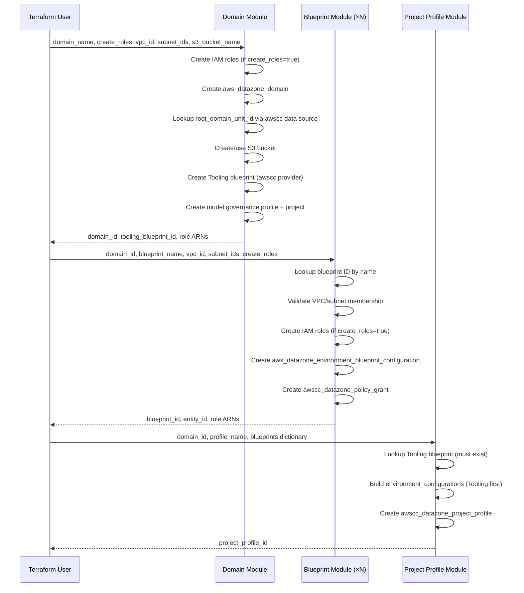

# Design Document: SageMaker Studio Refactoring

## Overview

This design describes the refactoring of the SageMaker Unified Studio (DataZone V2) Terraform module from a monolithic architecture to a modular, composable architecture. The refactoring targets three primary areas:

1. **Blueprint Module Singularization** — Replace the monolithic blueprints module (which configures multiple blueprints simultaneously via boolean flags) with a singular module that creates exactly one blueprint configuration per invocation.
2. **Tooling Blueprint Integration** — Move the Tooling blueprint (a required, always-on blueprint) into the domain module so it is created alongside the domain itself.
3. **Project Profile Module Singularization** — Replace the monolithic project profiles module with a singular module that accepts a dictionary of blueprints and creates one project profile per invocation.

Additionally, the domain module gains IAM role creation capabilities (`create_roles` toggle), model governance role management, user role policy configuration, and optional S3 bucket creation.

### Provider Strategy

- Use the `aws` provider (hashicorp/aws >= 6.28.0) as the primary provider for all resources.
- Use the `awscc` provider (hashicorp/awscc >= 1.68.0) only when the `aws` provider lacks a required resource or attribute:
  - `awscc_datazone_environment_blueprint_configuration` — needed for `global_parameters` (Tooling blueprint's `QueryExecutionRoleArn`)
  - `awscc_datazone_project_profile` — no `aws` equivalent exists
  - `awscc_datazone_policy_grant` — no `aws` equivalent exists
  - `awscc_datazone_domain` data source — needed for `root_domain_unit_id`

## Architecture

### High-Level Module Architecture

```mermaid
graph TB
    subgraph "Root Module (Domain)"
        DM[aws_datazone_domain]
        AWSCC_DOMAIN[data.awscc_datazone_domain<br/>root_domain_unit_id lookup]
        TB[awscc_datazone_environment_blueprint_configuration<br/>Tooling Blueprint - awscc provider]
        S3[aws_s3_bucket<br/>Optional dedicated bucket]
        MGP[awscc_datazone_project_profile<br/>Model Governance Profile]
        MGPROJ[awscc_datazone_project<br/>Model Governance Project]
        IAM_DOMAIN[IAM Roles<br/>DomainExecution, DomainService,<br/>ModelManagement, ModelConsumption]
    end

    subgraph "Blueprint Module (singular, invoked N times)"
        BP_DATA[data.aws_datazone_environment_blueprint<br/>ID lookup by name]
        BP_RES[aws_datazone_environment_blueprint_configuration<br/>Single blueprint]
        BP_POLICY[awscc_datazone_policy_grant<br/>CREATE_ENVIRONMENT_FROM_BLUEPRINT]
        BP_IAM[IAM Roles<br/>ManageAccess, Provisioning<br/>conditional creation]
        BP_SUBNET[data.aws_subnet<br/>VPC membership validation]
    end

    subgraph "Project Profile Module (singular, invoked N times)"
        PP_TOOLING[data.aws_datazone_environment_blueprint<br/>Tooling lookup]
        PP_RES[awscc_datazone_project_profile<br/>Single profile]
    end

    subgraph "Quick-Setup Example"
        QS[examples/quick-setup/main.tf]
    end

    DM --> AWSCC_DOMAIN
    DM --> TB
    DM --> S3
    DM --> MGP --> MGPROJ
    IAM_DOMAIN --> DM

    QS --> DM
    QS -->|"module.blueprint[\"LakehouseCatalog\"]"| BP_DATA
    QS -->|"module.blueprint[\"MLExperiments\"]"| BP_DATA
    QS -->|"module.blueprint[\"RedshiftServerless\"]"| BP_DATA
    BP_DATA --> BP_RES --> BP_POLICY
    BP_IAM --> BP_RES

    QS --> PP_TOOLING
    PP_TOOLING --> PP_RES

    TB -.->|tooling_blueprint_id| PP_TOOLING
    BP_RES -.->|blueprint_id| PP_RES
```

### Data Flow




## Components and Interfaces

### 1. Domain Module (Root Module — `main.tf`)

The root module creates the SageMaker Unified Studio domain, the Tooling blueprint, IAM roles, model governance resources, and an optional S3 bucket.

#### Variables Interface (`variables.tf`)

```hcl
# --- Domain Configuration ---
variable "domain_name" {
  description = "Name of the DataZone domain"
  type        = string
  default     = null
  validation {
    condition     = var.domain_name == null || can(regex("^[a-zA-Z0-9][a-zA-Z0-9-]*[a-zA-Z0-9]$", var.domain_name))
    error_message = "Domain name must contain only alphanumeric characters and hyphens."
  }
}

variable "description" {
  type    = string
  default = "SageMaker Unified Studio domain managed by Terraform"
}

variable "enable_sso" {
  type    = bool
  default = false
}

variable "kms_key_identifier" {
  type    = string
  default = null
}

variable "tags" {
  type    = map(string)
  default = {}
}

# --- IAM Role Configuration ---
variable "create_roles" {
  description = "Whether to auto-create required IAM roles. When false, all role ARNs must be provided."
  type        = bool
  default     = true
}

variable "domain_execution_role_arn" {
  description = "ARN of existing AmazonSageMakerDomainExecution role. Required when create_roles=false."
  type        = string
  default     = null
  validation {
    condition     = var.domain_execution_role_arn == null || can(regex("^arn:aws:iam::[0-9]{12}:role/.+", var.domain_execution_role_arn))
    error_message = "Must be a valid IAM role ARN."
  }
}

variable "domain_service_role_arn" {
  description = "ARN of existing AmazonSageMakerDomainService role. Required when create_roles=false."
  type        = string
  default     = null
  validation {
    condition     = var.domain_service_role_arn == null || can(regex("^arn:aws:iam::[0-9]{12}:role/.+", var.domain_service_role_arn))
    error_message = "Must be a valid IAM role ARN."
  }
}

variable "model_management_role_arn" {
  description = "ARN of existing AmazonDataZoneBedrockModelManagementRole. Required when create_roles=false."
  type        = string
  default     = null
}

variable "model_consumption_role_arn" {
  description = "ARN of existing AmazonDataZoneBedrockFMConsumptionRole. Required when create_roles=false."
  type        = string
  default     = null
}

# --- Tooling Blueprint Configuration ---
variable "vpc_id" {
  description = "VPC ID for Tooling blueprint regional parameters"
  type        = string
  validation {
    condition     = can(regex("^vpc-[a-z0-9]+$", var.vpc_id))
    error_message = "VPC ID must match pattern vpc-xxx."
  }
}

variable "subnet_ids" {
  description = "Subnet IDs for Tooling blueprint regional parameters"
  type        = list(string)
  validation {
    condition     = length(var.subnet_ids) > 0
    error_message = "At least one subnet ID required."
  }
  validation {
    condition     = alltrue([for s in var.subnet_ids : can(regex("^subnet-[a-z0-9]+$", s))])
    error_message = "All subnet IDs must match pattern subnet-xxx."
  }
}

variable "s3_bucket_name" {
  description = "Existing S3 bucket name for Tooling. If null, a dedicated bucket is created."
  type        = string
  default     = null
}

# --- User Role Policy ---
variable "user_role_policy_arn" {
  description = "IAM policy ARN to apply to the Tooling blueprint as user role policy"
  type        = string
  default     = null
  validation {
    condition     = var.user_role_policy_arn == null || can(regex("^arn:aws:iam::[0-9]{12}:policy/.+", var.user_role_policy_arn))
    error_message = "Must be a valid IAM policy ARN."
  }
}
```

#### Resource Creation Logic

```hcl
locals {
  account_id = data.aws_caller_identity.current.account_id
  region     = data.aws_region.current.id

  # Resolve role ARNs: use provided or construct default names
  domain_execution_role_arn = var.domain_execution_role_arn != null ? var.domain_execution_role_arn : (
    var.create_roles ? aws_iam_role.domain_execution[0].arn : null
  )
  domain_service_role_arn = var.domain_service_role_arn != null ? var.domain_service_role_arn : (
    var.create_roles ? aws_iam_role.domain_service[0].arn : null
  )
  model_management_role_arn = var.model_management_role_arn != null ? var.model_management_role_arn : (
    var.create_roles ? aws_iam_role.model_management[0].arn : null
  )
  model_consumption_role_arn = var.model_consumption_role_arn != null ? var.model_consumption_role_arn : (
    var.create_roles ? aws_iam_role.model_consumption[0].arn : null
  )

  # S3 bucket: use provided or create dedicated
  s3_bucket_name = var.s3_bucket_name != null ? var.s3_bucket_name : aws_s3_bucket.domain[0].id
}
```

**Validation preconditions** (Terraform 1.5+ `precondition` blocks):

```hcl
# In the domain resource or a check block:
lifecycle {
  precondition {
    condition     = var.create_roles || (var.domain_execution_role_arn != null && var.domain_service_role_arn != null && var.model_management_role_arn != null && var.model_consumption_role_arn != null)
    error_message = "When create_roles is false, all role ARNs must be provided."
  }
}
```

**IAM Role Creation Pattern** (conditional, one role per resource):

```hcl
# Create DomainExecution role only if create_roles=true AND no ARN provided
resource "aws_iam_role" "domain_execution" {
  count = var.create_roles && var.domain_execution_role_arn == null ? 1 : 0
  name  = "AmazonSageMakerDomainExecution"
  assume_role_policy = jsonencode({
    Version = "2012-10-17"
    Statement = [{
      Effect    = "Allow"
      Principal = { Service = "datazone.amazonaws.com" }
      Action    = "sts:AssumeRole"
    }]
  })
}

resource "aws_iam_role_policy_attachment" "domain_execution" {
  count      = var.create_roles && var.domain_execution_role_arn == null ? 1 : 0
  role       = aws_iam_role.domain_execution[0].name
  policy_arn = "arn:aws:iam::aws:policy/SageMakerStudioDomainExecutionRolePolicy"
}

# Same pattern for DomainService, ModelManagement, ModelConsumption roles
```

**Tooling Blueprint** (awscc provider for `global_parameters`):

```hcl
data "aws_datazone_environment_blueprint" "tooling" {
  domain_id = aws_datazone_domain.main.id
  name      = "Tooling"
  managed   = true
}

resource "awscc_datazone_environment_blueprint_configuration" "tooling" {
  domain_identifier                = aws_datazone_domain.main.id
  environment_blueprint_identifier = data.aws_datazone_environment_blueprint.tooling.id
  enabled_regions                  = [local.region]
  manage_access_role_arn           = local.manage_access_role_arn
  provisioning_role_arn            = local.provisioning_role_arn

  regional_parameters = [{
    region = local.region
    parameters = {
      "S3Location" = "s3://${local.s3_bucket_name}"
      "Subnets"    = join(",", var.subnet_ids)
      "VpcId"      = var.vpc_id
    }
  }]

  # global_parameters is only available on awscc provider
  global_parameters = var.user_role_policy_arn != null ? {
    "QueryExecutionRoleArn" = local.query_execution_role_arn
    "UserRolePolicyArn"     = var.user_role_policy_arn
  } : {
    "QueryExecutionRoleArn" = local.query_execution_role_arn
  }

  depends_on = [aws_datazone_domain.main]
}
```

**Optional S3 Bucket**:

```hcl
resource "aws_s3_bucket" "domain" {
  count  = var.s3_bucket_name == null ? 1 : 0
  bucket = "sagemaker-studio-${local.account_id}-${local.region}"

  tags = merge(var.tags, {
    Purpose = "SageMaker Unified Studio Domain Storage"
  })
}

resource "aws_s3_bucket_server_side_encryption_configuration" "domain" {
  count  = var.s3_bucket_name == null ? 1 : 0
  bucket = aws_s3_bucket.domain[0].id
  rule {
    apply_server_side_encryption_by_default {
      sse_algorithm = "AES256"
    }
  }
}

resource "aws_s3_bucket_public_access_block" "domain" {
  count                   = var.s3_bucket_name == null ? 1 : 0
  bucket                  = aws_s3_bucket.domain[0].id
  block_public_acls       = true
  block_public_policy     = true
  ignore_public_acls      = true
  restrict_public_buckets = true
}
```

#### Outputs

```hcl
output "domain_id" { value = aws_datazone_domain.main.id }
output "domain_arn" { value = aws_datazone_domain.main.arn }
output "domain_url" { value = aws_datazone_domain.main.portal_url }
output "domain_root_unit_id" { value = data.awscc_datazone_domain.main.root_domain_unit_id }
output "tooling_blueprint_id" { value = data.aws_datazone_environment_blueprint.tooling.id }
output "domain_execution_role_arn" { value = local.domain_execution_role_arn }
output "domain_service_role_arn" { value = local.domain_service_role_arn }
output "model_management_role_arn" { value = local.model_management_role_arn }
output "model_consumption_role_arn" { value = local.model_consumption_role_arn }
output "s3_bucket_name" { value = local.s3_bucket_name }
```

### 2. Blueprint Module (`modules/blueprint/`)

A singular module that creates exactly one blueprint configuration per invocation. Users invoke it multiple times with different `blueprint_name` values.

#### Variables Interface

```hcl
variable "domain_id" {
  description = "The DataZone domain ID"
  type        = string
  validation {
    condition     = can(regex("^dzd[-_][a-zA-Z0-9_-]{1,36}$", var.domain_id))
    error_message = "Domain ID must match format dzd-xxx or dzd_xxx."
  }
}

variable "blueprint_name" {
  description = "Name of the blueprint to configure (e.g., LakehouseCatalog, MLExperiments, RedshiftServerless)"
  type        = string
  validation {
    condition = contains([
      "AmazonBedrockGenerativeAI", "AmazonBedrockChatAgent", "AmazonBedrockEvaluation",
      "AmazonBedrockFlow", "AmazonBedrockFunction", "AmazonBedrockGuardrail",
      "AmazonBedrockKnowledgeBase", "AmazonBedrockPrompt", "DataLake",
      "EMRonEC2", "EMRServerless", "LakehouseCatalog", "MLExperiments",
      "PartnerApps", "RedshiftServerless", "Workflows", "Quicksight"
    ], var.blueprint_name)
    error_message = "blueprint_name must be one of the supported SageMaker Unified Studio blueprint names."
  }
}

variable "vpc_id" {
  description = "VPC ID for regional parameters"
  type        = string
  validation {
    condition     = can(regex("^vpc-[a-z0-9]+$", var.vpc_id))
    error_message = "VPC ID must match pattern vpc-xxx."
  }
}

variable "subnet_ids" {
  description = "Subnet IDs for regional parameters"
  type        = list(string)
  validation {
    condition     = length(var.subnet_ids) > 0
    error_message = "At least one subnet ID required."
  }
  validation {
    condition     = alltrue([for s in var.subnet_ids : can(regex("^subnet-[a-z0-9]+$", s))])
    error_message = "All subnet IDs must match pattern subnet-xxx."
  }
}

variable "s3_bucket_name" {
  description = "S3 bucket name for blueprint storage"
  type        = string
}

variable "domain_root_unit_id" {
  description = "Root domain unit ID for policy grants"
  type        = string
}

variable "create_roles" {
  description = "Whether to auto-create ManageAccess and Provisioning roles"
  type        = bool
  default     = true
}

variable "manage_access_role_arn" {
  description = "ARN of existing ManageAccess role. Required when create_roles=false."
  type        = string
  default     = null
}

variable "provisioning_role_arn" {
  description = "ARN of existing Provisioning role. Required when create_roles=false."
  type        = string
  default     = null
}

variable "allow_replace_existing" {
  description = "Allow replacing an existing blueprint configuration for this domain/account"
  type        = bool
  default     = false
}

variable "enabled_regions" {
  description = "List of AWS regions to enable the blueprint in"
  type        = list(string)
  default     = null  # defaults to current region
}

variable "configure_lake_formation" {
  description = "Whether to configure Lake Formation admin permissions"
  type        = bool
  default     = true
}

variable "domain_execution_role_arn" {
  description = "Domain execution role ARN for Lake Formation admin"
  type        = string
  default     = null
}

variable "tags" {
  type    = map(string)
  default = {}
}
```

#### Resource Creation Logic

```hcl
data "aws_caller_identity" "current" {}
data "aws_region" "current" {}

# Resolve blueprint ID from name
data "aws_datazone_environment_blueprint" "this" {
  domain_id = var.domain_id
  name      = var.blueprint_name
  managed   = true
}

# Lookup domain for root_domain_unit_id
data "awscc_datazone_domain" "this" {
  id = var.domain_id
}

# Validate subnets are in the specified VPC
data "aws_subnet" "validation" {
  for_each = toset(var.subnet_ids)
  id       = each.value
}

locals {
  account_id = data.aws_caller_identity.current.account_id
  region     = data.aws_region.current.id

  manage_access_role_arn = var.manage_access_role_arn != null ? var.manage_access_role_arn : (
    var.create_roles ? aws_iam_role.manage_access[0].arn : null
  )
  provisioning_role_arn = var.provisioning_role_arn != null ? var.provisioning_role_arn : (
    var.create_roles ? "arn:aws:iam::${local.account_id}:role/service-role/AmazonSageMakerProvisioning-${local.account_id}" : null
  )

  enabled_regions = var.enabled_regions != null ? var.enabled_regions : [local.region]

  # Build regional_parameters for each enabled region
  regional_parameters = {
    for r in local.enabled_regions : r => {
      "S3Location" = "s3://${var.s3_bucket_name}"
      "Subnets"    = join(",", var.subnet_ids)
      "VpcId"      = var.vpc_id
    }
  }
}

# Validate subnets belong to the VPC
resource "terraform_data" "subnet_vpc_validation" {
  for_each = data.aws_subnet.validation

  lifecycle {
    precondition {
      condition     = each.value.vpc_id == var.vpc_id
      error_message = "Subnet ${each.key} belongs to VPC ${each.value.vpc_id}, not ${var.vpc_id}."
    }
  }
}

# Validate create_roles precondition
resource "terraform_data" "role_validation" {
  lifecycle {
    precondition {
      condition     = var.create_roles || (var.manage_access_role_arn != null && var.provisioning_role_arn != null)
      error_message = "When create_roles is false, manage_access_role_arn and provisioning_role_arn must be provided."
    }
  }
}

# Single blueprint configuration (aws provider)
resource "aws_datazone_environment_blueprint_configuration" "this" {
  domain_id                = var.domain_id
  environment_blueprint_id = data.aws_datazone_environment_blueprint.this.id
  manage_access_role_arn   = local.manage_access_role_arn
  provisioning_role_arn    = local.provisioning_role_arn
  enabled_regions          = local.enabled_regions
  regional_parameters      = local.regional_parameters

  depends_on = [
    terraform_data.subnet_vpc_validation,
    terraform_data.role_validation
  ]
}

# Policy grant for CREATE_ENVIRONMENT_FROM_BLUEPRINT
resource "awscc_datazone_policy_grant" "this" {
  domain_identifier = var.domain_id
  entity_type       = "ENVIRONMENT_BLUEPRINT_CONFIGURATION"
  entity_identifier = "${local.account_id}:${data.aws_datazone_environment_blueprint.this.id}"
  policy_type       = "CREATE_ENVIRONMENT_FROM_BLUEPRINT"
  detail = {
    create_environment_from_blueprint = jsonencode({})
  }
  principal = {
    project = {
      project_designation = "CONTRIBUTOR"
      project_grant_filter = {
        domain_unit_filter = {
          domain_unit                = var.domain_root_unit_id
          include_child_domain_units = true
        }
      }
    }
  }

  depends_on = [aws_datazone_environment_blueprint_configuration.this]
}
```

#### Conditional IAM Role Creation

```hcl
resource "aws_iam_role" "manage_access" {
  count = var.create_roles && var.manage_access_role_arn == null ? 1 : 0
  name  = "AmazonSageMakerManageAccess-${local.region}-${var.domain_id}"

  assume_role_policy = jsonencode({
    Version = "2012-10-17"
    Statement = [{
      Effect    = "Allow"
      Principal = { Service = "datazone.amazonaws.com" }
      Action    = "sts:AssumeRole"
      Condition = {
        StringEquals = { "aws:SourceAccount" = local.account_id }
      }
    }]
  })

  tags = var.tags
}

resource "aws_iam_role_policy_attachment" "manage_access_glue" {
  count      = var.create_roles && var.manage_access_role_arn == null ? 1 : 0
  role       = aws_iam_role.manage_access[0].name
  policy_arn = "arn:aws:iam::aws:policy/AmazonDataZoneGlueManageAccessRolePolicy"
}

resource "aws_iam_role_policy_attachment" "manage_access_redshift" {
  count      = var.create_roles && var.manage_access_role_arn == null ? 1 : 0
  role       = aws_iam_role.manage_access[0].name
  policy_arn = "arn:aws:iam::aws:policy/AmazonDataZoneRedshiftManageAccessRolePolicy"
}

resource "aws_iam_role_policy_attachment" "manage_access_sagemaker" {
  count      = var.create_roles && var.manage_access_role_arn == null ? 1 : 0
  role       = aws_iam_role.manage_access[0].name
  policy_arn = "arn:aws:iam::aws:policy/AmazonDataZoneSageMakerAccess"
}
```

#### Outputs

```hcl
output "blueprint_id" {
  value = data.aws_datazone_environment_blueprint.this.id
}

output "blueprint_name" {
  value = var.blueprint_name
}

output "entity_id" {
  value = "${local.account_id}:${data.aws_datazone_environment_blueprint.this.id}"
}

output "manage_access_role_arn" {
  value = local.manage_access_role_arn
}

output "provisioning_role_arn" {
  value = local.provisioning_role_arn
}
```

### 3. Project Profile Module (`modules/project-profile/`)

A singular module that creates exactly one project profile. Accepts a dictionary of blueprints with their parameters. Each blueprint entry specifies a `blueprint_name` which is used to perform a data lookup to resolve the blueprint ID and verify the blueprint is enabled/configured in the account and region.

#### Variables Interface

```hcl
variable "domain_id" {
  description = "The DataZone domain ID"
  type        = string
  validation {
    condition     = can(regex("^dzd[-_][a-zA-Z0-9_-]{1,36}$", var.domain_id))
    error_message = "Domain ID must match format dzd-xxx or dzd_xxx."
  }
}

variable "profile_name" {
  description = "Name for the project profile"
  type        = string
  validation {
    condition     = length(var.profile_name) > 0 && length(var.profile_name) <= 64
    error_message = "Profile name must be between 1 and 64 characters."
  }
}

variable "blueprints" {
  description = "Dictionary of blueprints to include in the project profile. Each key is a logical name, and each entry specifies the blueprint_name for data lookup."
  type = map(object({
    blueprint_name = string  # e.g., "LakehouseCatalog", "MLExperiments", "RedshiftServerless"
    deployment_mode = optional(string, "ON_CREATE")  # ON_CREATE or ON_DEMAND
    default_parameters = optional(map(string), {})
    editable_parameters = optional(map(object({
      value       = string
      is_editable = optional(bool, true)
    })), {})
  }))

  validation {
    condition = alltrue([
      for k, v in var.blueprints : contains(["ON_CREATE", "ON_DEMAND"], v.deployment_mode)
    ])
    error_message = "deployment_mode must be ON_CREATE or ON_DEMAND."
  }

  validation {
    condition = alltrue([
      for k, v in var.blueprints : contains([
        "AmazonBedrockGenerativeAI", "AmazonBedrockChatAgent", "AmazonBedrockEvaluation",
        "AmazonBedrockFlow", "AmazonBedrockFunction", "AmazonBedrockGuardrail",
        "AmazonBedrockKnowledgeBase", "AmazonBedrockPrompt", "DataLake",
        "EMRonEC2", "EMRServerless", "LakehouseCatalog", "MLExperiments",
        "PartnerApps", "RedshiftServerless", "Tooling", "Workflows", "Quicksight"
      ], v.blueprint_name)
    ])
    error_message = "blueprint_name must be one of the supported SageMaker Unified Studio blueprint names."
  }
}

variable "aws_account_id" {
  description = "AWS account ID for environment configurations"
  type        = string
  default     = null  # defaults to current account
}

variable "aws_region" {
  description = "AWS region for environment configurations"
  type        = string
  default     = null  # defaults to current region
}

variable "status" {
  description = "Profile status"
  type        = string
  default     = "ENABLED"
}
```

#### Resource Creation Logic

```hcl
data "aws_caller_identity" "current" {}
data "aws_region" "current" {}

# Lookup Tooling blueprint — must be configured in the account/region
data "aws_datazone_environment_blueprint" "tooling" {
  domain_id = var.domain_id
  name      = "Tooling"
  managed   = true
}

# Lookup domain for root_domain_unit_id
data "awscc_datazone_domain" "this" {
  id = var.domain_id
}

# Lookup each blueprint by its blueprint_name — this also validates the blueprint
# is enabled/configured in the account and region (data source will fail if not found)
data "aws_datazone_environment_blueprint" "blueprints" {
  for_each  = { for k, v in var.blueprints : k => v if v.blueprint_name != "Tooling" }
  domain_id = var.domain_id
  name      = each.value.blueprint_name
  managed   = true
}

locals {
  account_id = var.aws_account_id != null ? var.aws_account_id : data.aws_caller_identity.current.account_id
  region     = var.aws_region != null ? var.aws_region : data.aws_region.current.id

  # Tooling is always first (deployment_order=1, ON_CREATE)
  # Uses the data source lookup — ignores any user-specified Tooling configuration
  tooling_config = {
    name                     = "Tooling"
    environment_blueprint_id = data.aws_datazone_environment_blueprint.tooling.id
    deployment_order         = 1
    deployment_mode          = "ON_CREATE"
    aws_account              = { aws_account_id = local.account_id }
    aws_region               = { region_name = local.region }
  }

  # Filter out Tooling entries from user input, sort remaining keys for deterministic ordering
  non_tooling_entries = { for k, v in var.blueprints : k => v if v.blueprint_name != "Tooling" }
  non_tooling_keys    = sort(keys(local.non_tooling_entries))

  blueprint_configs = [
    for idx, key in local.non_tooling_keys : {
      name                     = local.non_tooling_entries[key].blueprint_name
      environment_blueprint_id = data.aws_datazone_environment_blueprint.blueprints[key].id
      deployment_order         = idx + 2
      deployment_mode          = local.non_tooling_entries[key].deployment_mode
      aws_account              = { aws_account_id = local.account_id }
      aws_region               = { region_name = local.region }
      configuration_parameters = length(local.non_tooling_entries[key].default_parameters) > 0 || length(local.non_tooling_entries[key].editable_parameters) > 0 ? {
        resolved_parameters = [
          for pk, pv in local.non_tooling_entries[key].default_parameters : {
            name        = pk
            value       = pv
            is_editable = false
          }
        ]
        parameter_overrides = [
          for pk, pv in local.non_tooling_entries[key].editable_parameters : {
            name        = pk
            value       = pv.value
            is_editable = pv.is_editable
          }
        ]
      } : null
    }
  ]

  # Final environment_configurations: Tooling first, then the rest
  environment_configurations = concat([local.tooling_config], local.blueprint_configs)
}

resource "awscc_datazone_project_profile" "this" {
  name                       = var.profile_name
  status                     = var.status
  domain_identifier          = var.domain_id
  domain_unit_identifier     = data.awscc_datazone_domain.this.root_domain_unit_id
  environment_configurations = local.environment_configurations
}
```

#### Outputs

```hcl
output "project_profile_id" {
  value = awscc_datazone_project_profile.this.project_profile_id
}

output "profile_name" {
  value = var.profile_name
}

output "environment_count" {
  value = length(local.environment_configurations)
}
```

## Data Models

### Resource Dependency Graph

The following shows the creation order and dependencies between Terraform resources:

```
Phase 1: IAM Roles (Domain Module)
  ├── aws_iam_role.domain_execution (conditional)
  ├── aws_iam_role.domain_service (conditional)
  ├── aws_iam_role.model_management (conditional)
  └── aws_iam_role.model_consumption (conditional)

Phase 2: Domain + S3 (Domain Module)
  ├── aws_s3_bucket.domain (conditional, if no bucket provided)
  └── aws_datazone_domain.main
      └── data.awscc_datazone_domain.main (root_domain_unit_id)

Phase 3: Tooling Blueprint (Domain Module)
  └── awscc_datazone_environment_blueprint_configuration.tooling
      ├── depends_on: aws_datazone_domain.main
      └── uses: global_parameters (QueryExecutionRoleArn, UserRolePolicyArn)

Phase 4: Model Governance (Domain Module)
  ├── awscc_datazone_project_profile.model_governance_project_profile
  └── awscc_datazone_project.model_governance_project

Phase 5: Additional Blueprints (Blueprint Module × N)
  └── For each blueprint invocation:
      ├── data.aws_datazone_environment_blueprint.this (ID lookup)
      ├── data.aws_subnet.validation (VPC membership check)
      ├── aws_iam_role.manage_access (conditional)
      ├── aws_datazone_environment_blueprint_configuration.this
      └── awscc_datazone_policy_grant.this

Phase 6: Project Profiles (Project Profile Module × N)
  └── For each profile invocation:
      ├── data.aws_datazone_environment_blueprint.tooling (must exist)
      ├── data.aws_datazone_environment_blueprint.blueprints (per blueprint)
      └── awscc_datazone_project_profile.this
```

### Blueprint Configuration Data Shape

Each blueprint configuration (in the `aws_datazone_environment_blueprint_configuration` resource) follows this shape:

| Field | Type | Source |
|-------|------|--------|
| `domain_id` | string | User input |
| `environment_blueprint_id` | string | Resolved via `data.aws_datazone_environment_blueprint` by name |
| `enabled_regions` | list(string) | User input or defaults to current region |
| `manage_access_role_arn` | string | Created or user-provided |
| `provisioning_role_arn` | string | Created or user-provided |
| `regional_parameters` | map(map(string)) | Built from vpc_id, subnet_ids, s3_bucket_name per region |

### Project Profile Environment Configuration Data Shape

Each entry in `environment_configurations` (in the `awscc_datazone_project_profile` resource):

| Field | Type | Notes |
|-------|------|-------|
| `name` | string | Blueprint display name |
| `environment_blueprint_id` | string | Resolved via data lookup |
| `deployment_order` | number | Tooling=1, others start at 2 |
| `deployment_mode` | string | `ON_CREATE` or `ON_DEMAND` |
| `aws_account.aws_account_id` | string | Target account |
| `aws_region.region_name` | string | Target region |
| `configuration_parameters.resolved_parameters` | list(object) | Default (non-editable) params |
| `configuration_parameters.parameter_overrides` | list(object) | Editable params |

### IAM Role Summary

| Role Name | Created By | Condition | Attached Policy |
|-----------|-----------|-----------|-----------------|
| `AmazonSageMakerDomainExecution` | Domain Module | `create_roles && domain_execution_role_arn == null` | `SageMakerStudioDomainExecutionRolePolicy` |
| `AmazonSageMakerDomainService` | Domain Module | `create_roles && domain_service_role_arn == null` | `SageMakerStudioDomainServiceRolePolicy` |
| `AmazonDataZoneBedrockModelManagementRole` | Domain Module | `create_roles && model_management_role_arn == null` | `AmazonDataZoneBedrockModelManagementPolicy` |
| `AmazonDataZoneBedrockFMConsumptionRole` | Domain Module | `create_roles && model_consumption_role_arn == null` | `AmazonDataZoneBedrockModelConsumptionPolicy` |
| `AmazonSageMakerManageAccess-<region>-<domainId>` | Blueprint Module | `create_roles && manage_access_role_arn == null` | `AmazonDataZoneGlueManageAccessRolePolicy`, `AmazonDataZoneRedshiftManageAccessRolePolicy`, `AmazonDataZoneSageMakerAccess` |
| `AmazonSageMakerProvisioning-<accountId>` | Blueprint Module | `create_roles && provisioning_role_arn == null` | `SageMakerStudioProjectProvisioningRolePolicy` |


## Correctness Properties

*A property is a characteristic or behavior that should hold true across all valid executions of a system — essentially, a formal statement about what the system should do. Properties serve as the bridge between human-readable specifications and machine-verifiable correctness guarantees.*

### Property 1: VPC ID format validation

*For any* string input to `vpc_id`, the module SHALL accept it if and only if it matches the regex pattern `^vpc-[a-z0-9]+$`. All non-matching strings SHALL be rejected at validation time.

**Validates: Requirements 1.9, 5.6**

### Property 2: Subnet ID format validation

*For any* list of strings input to `subnet_ids`, the module SHALL accept the list if and only if every element matches the regex pattern `^subnet-[a-z0-9]+$`. If any element does not match, the entire input SHALL be rejected.

**Validates: Requirements 1.10, 5.7**

### Property 3: Conditional IAM role creation

*For any* role type (DomainExecution, DomainService, ModelManagement, ModelConsumption, ManageAccess, Provisioning) and any combination of `create_roles` (true/false) and role ARN (provided/null): when `create_roles` is true and the corresponding role ARN is null, exactly one IAM role resource of that type SHALL be present in the plan. When the role ARN is provided (regardless of `create_roles`), no IAM role resource of that type SHALL be created. When `create_roles` is true and only some role ARNs are provided, only the missing roles SHALL be created.

**Validates: Requirements 1.6, 4.2, 4.3, 4.7, 6.2, 7.2**

### Property 4: Validation failure when create_roles is false and role ARNs missing

*For any* module invocation where `create_roles` is false, if any required role ARN is not provided, the module SHALL fail validation with an appropriate error message. This applies to both the domain module (DomainExecution, DomainService, ModelManagement, ModelConsumption) and the blueprint module (ManageAccess, Provisioning).

**Validates: Requirements 1.6, 4.4, 6.3, 7.3**

### Property 5: Regional parameters include VPC and subnet configuration

*For any* valid `vpc_id` and `subnet_ids` input, the resulting `regional_parameters` of the blueprint configuration SHALL contain `VpcId` equal to the input `vpc_id` and `Subnets` equal to the comma-joined string of `subnet_ids`.

**Validates: Requirements 5.3, 5.4**

### Property 6: Tooling blueprint is always first in project profile

*For any* blueprint dictionary passed to the project profile module (including dictionaries that contain a "Tooling" key), the resulting `environment_configurations` SHALL have Tooling as the first entry with `deployment_order = 1` and `deployment_mode = "ON_CREATE"`, and the Tooling configuration SHALL use the blueprint ID from the data source lookup (not from user input).

**Validates: Requirements 2.4, 2.6**

### Property 7: S3 bucket conditional creation

*For any* domain module invocation, when `s3_bucket_name` is null, exactly one `aws_s3_bucket` resource SHALL be present in the plan. When `s3_bucket_name` is provided, no `aws_s3_bucket` resource SHALL be created, and the provided bucket name SHALL be used in the Tooling blueprint's regional parameters.

**Validates: Requirements 3.7**

### Property 8: User role policy applied to Tooling blueprint

*For any* valid `user_role_policy_arn` input, the Tooling blueprint's `global_parameters` SHALL contain a `UserRolePolicyArn` key with the provided ARN value. When `user_role_policy_arn` is null, the `global_parameters` SHALL NOT contain a `UserRolePolicyArn` key.

**Validates: Requirements 8.2**

### Property 9: User role policy ARN format validation

*For any* non-null string input to `user_role_policy_arn`, the module SHALL accept it if and only if it matches the IAM policy ARN pattern `^arn:aws:iam::[0-9]{12}:policy/.+$`. All non-matching strings SHALL be rejected.

**Validates: Requirements 8.4**

### Property 10: Blueprint name validation

*For any* string input to `blueprint_name`, the blueprint module SHALL accept it if and only if it is one of the supported blueprint names (AmazonBedrockGenerativeAI, AmazonBedrockChatAgent, AmazonBedrockEvaluation, AmazonBedrockFlow, AmazonBedrockFunction, AmazonBedrockGuardrail, AmazonBedrockKnowledgeBase, AmazonBedrockPrompt, DataLake, EMRonEC2, EMRServerless, LakehouseCatalog, MLExperiments, PartnerApps, RedshiftServerless, Workflows, Quicksight). All other strings SHALL be rejected.

**Validates: Requirements 1.1**

## Error Handling

### Validation Errors

| Error Condition | Module | Mechanism | Error Message |
|----------------|--------|-----------|---------------|
| Invalid `vpc_id` format | Blueprint, Domain | `variable` validation block | "VPC ID must match pattern vpc-xxx." |
| Invalid `subnet_ids` format | Blueprint, Domain | `variable` validation block | "All subnet IDs must match pattern subnet-xxx." |
| Subnet not in VPC | Blueprint | `terraform_data` precondition | "Subnet {id} belongs to VPC {actual}, not {expected}." |
| `create_roles=false` with missing ARNs | Domain, Blueprint | `lifecycle` precondition | "When create_roles is false, all role ARNs must be provided." |
| Invalid `blueprint_name` | Blueprint | `variable` validation block | "blueprint_name must be one of the supported blueprint names." |
| Invalid `domain_id` format | Blueprint, Profile | `variable` validation block | "Domain ID must match format dzd-xxx or dzd_xxx." |
| Invalid `user_role_policy_arn` format | Domain | `variable` validation block | "Must be a valid IAM policy ARN." |
| Invalid `deployment_mode` | Profile | `variable` validation block | "deployment_mode must be ON_CREATE or ON_DEMAND." |
| Tooling blueprint not configured | Profile | `data` source failure | Terraform data source error (blueprint not found) |
| Empty `subnet_ids` list | Blueprint, Domain | `variable` validation block | "At least one subnet ID required." |

### Runtime Errors

| Error Condition | Handling Strategy |
|----------------|-------------------|
| Blueprint already configured for domain/account | Use `allow_replace_existing` flag; when false, Terraform will error on resource creation conflict |
| IAM role already exists | Conditional creation (`count`) skips creation when ARN is provided; if `create_roles=true` and role exists externally, Terraform will error on name conflict |
| S3 bucket name already taken | User should provide a unique `s3_bucket_name` or let the module generate one |
| AWS API rate limiting | Terraform's built-in retry logic handles transient API errors |
| Lake Formation permission propagation | `time_sleep` resource provides a configurable delay after Lake Formation settings |

## Testing Strategy

### Dual Testing Approach

Testing uses both unit tests (specific examples and edge cases) and property-based tests (universal properties across generated inputs).

- **Unit tests**: Verify specific plan outputs, resource counts, attribute values for known inputs
- **Property-based tests**: Verify validation rules and conditional logic across randomly generated inputs

### Property-Based Testing Configuration

- **Library**: [Terraform test framework](https://developer.hashicorp.com/terraform/language/tests) (`*.tftest.hcl`) for plan-level assertions, supplemented by Go tests using `github.com/gruntwork-io/terratest` and `pgregory.net/rapid` (Go property-based testing library) for property tests that generate random inputs
- **Minimum iterations**: 100 per property test
- **Tag format**: Each test includes a comment: `# Feature: sagemaker-studio-refactoring, Property {N}: {title}`

### Test Structure

```
tests/
├── domain.tftest.hcl              # Domain module plan/apply tests
├── blueprint.tftest.hcl           # Blueprint module plan/apply tests  
├── project_profile.tftest.hcl     # Project profile module plan/apply tests
├── examples.tftest.hcl            # Quick-setup example plan test
├── properties/
│   └── validation_test.go         # Property-based tests for validation rules
└── integration/
    └── full_stack_test.go         # End-to-end apply tests
```

### Unit Tests (Terraform Test Framework)

Each module gets plan and apply test runs:

```hcl
# tests/blueprint.tftest.hcl

# Feature: sagemaker-studio-refactoring, Property 10: Blueprint name validation
run "blueprint_plan_lakehouse" {
  command = plan
  module {
    source = "./modules/blueprint"
  }
  variables {
    domain_id           = "dzd-test123"
    blueprint_name      = "LakehouseCatalog"
    vpc_id              = "vpc-abc123"
    subnet_ids          = ["subnet-abc123"]
    s3_bucket_name      = "test-bucket"
    domain_root_unit_id = "root-unit-id"
  }
  assert {
    condition     = aws_datazone_environment_blueprint_configuration.this.domain_id == "dzd-test123"
    error_message = "Blueprint should be configured for the correct domain."
  }
}

# Feature: sagemaker-studio-refactoring, Property 1: VPC ID format validation
run "blueprint_rejects_invalid_vpc" {
  command = plan
  module {
    source = "./modules/blueprint"
  }
  variables {
    domain_id      = "dzd-test123"
    blueprint_name = "LakehouseCatalog"
    vpc_id         = "invalid-vpc"
    subnet_ids     = ["subnet-abc123"]
    s3_bucket_name = "test-bucket"
    domain_root_unit_id = "root-unit-id"
  }
  expect_failures = [var.vpc_id]
}
```

### Property-Based Tests (Go + rapid)

```go
// tests/properties/validation_test.go
// Feature: sagemaker-studio-refactoring, Property 1: VPC ID format validation
func TestVpcIdValidation(t *testing.T) {
    rapid.Check(t, func(t *rapid.T) {
        vpcId := rapid.StringMatching(`vpc-[a-z0-9]{1,20}`).Draw(t, "valid_vpc_id")
        assert.Regexp(t, `^vpc-[a-z0-9]+$`, vpcId)
    })
}

// Feature: sagemaker-studio-refactoring, Property 2: Subnet ID format validation
func TestSubnetIdValidation(t *testing.T) {
    rapid.Check(t, func(t *rapid.T) {
        count := rapid.IntRange(1, 10).Draw(t, "subnet_count")
        subnets := make([]string, count)
        for i := range subnets {
            subnets[i] = rapid.StringMatching(`subnet-[a-z0-9]{1,20}`).Draw(t, fmt.Sprintf("subnet_%d", i))
        }
        for _, s := range subnets {
            assert.Regexp(t, `^subnet-[a-z0-9]+$`, s)
        }
    })
}

// Feature: sagemaker-studio-refactoring, Property 3: Conditional IAM role creation
func TestConditionalRoleCreation(t *testing.T) {
    rapid.Check(t, func(t *rapid.T) {
        createRoles := rapid.Bool().Draw(t, "create_roles")
        arnProvided := rapid.Bool().Draw(t, "arn_provided")

        if createRoles && !arnProvided {
            // Role should be created (count=1)
            assert.True(t, shouldCreateRole(createRoles, arnProvided))
        } else if arnProvided {
            // Role should NOT be created (count=0)
            assert.False(t, shouldCreateRole(createRoles, arnProvided))
        }
    })
}
```

### Integration Tests

Full-stack apply tests run against a real AWS account:

```hcl
# tests/examples.tftest.hcl
run "quick_setup_plan" {
  command = plan
  module {
    source = "./examples/quick-setup"
  }
}

run "quick_setup_apply" {
  command = apply
  module {
    source = "./examples/quick-setup"
  }
}
```

### Test Coverage Matrix

| Property | Unit Test | Property Test | Integration Test |
|----------|-----------|---------------|------------------|
| P1: VPC ID format | ✅ `expect_failures` | ✅ rapid | — |
| P2: Subnet ID format | ✅ `expect_failures` | ✅ rapid | — |
| P3: Conditional role creation | ✅ plan assertions | ✅ rapid | ✅ apply |
| P4: Validation failure (create_roles=false) | ✅ `expect_failures` | ✅ rapid | — |
| P5: Regional parameters | ✅ plan assertions | ✅ rapid | ✅ apply |
| P6: Tooling first in profile | ✅ plan assertions | ✅ rapid | ✅ apply |
| P7: S3 conditional creation | ✅ plan assertions | — | ✅ apply |
| P8: User role policy on Tooling | ✅ plan assertions | — | ✅ apply |
| P9: Policy ARN format | ✅ `expect_failures` | ✅ rapid | — |
| P10: Blueprint name validation | ✅ `expect_failures` | ✅ rapid | — |
