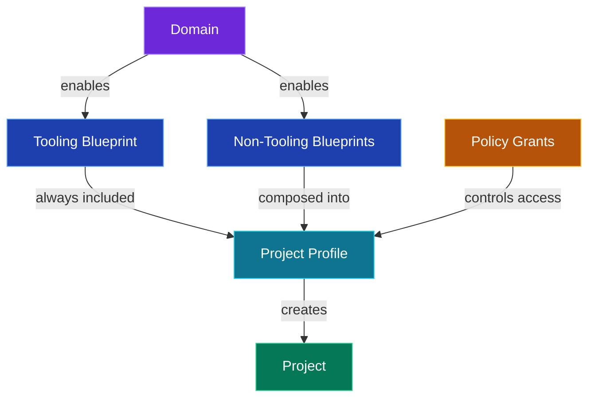
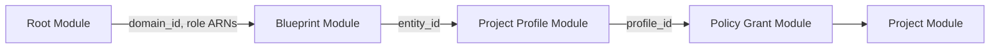

# SageMaker Unified Studio

## Infrastructure as Code with Terraform

<style>
  .slidev-page-number {
    font-size: 12px;
    opacity: 0.8;
  }
</style>

---
layout: default
---

# Agenda

| # | Section |
|---|---------|
| 1 | **What is SageMaker Unified Studio?** — Components & concepts |
| 2 | **Why Terraform for SageMaker Unified Studio?** |
| 3 | **Architecture** — Module design & resource map |
| 4 | **Key Design Decisions** — Role resolution, dual provider, safety |
| 5 | **Live Walkthrough** — Quick-setup example |
| 6 | **Next Steps & Wrap-up** |
---
layout: section
---

# 1 — What is SageMaker Unified Studio?

The platform and its building blocks

---

# SageMaker Unified Studio — Overview

A **single web-based environment** for data & AI teams to:

<v-clicks>

- **Discover & access** data across the organization
- **Build ML models** with SageMaker AI
- **Create GenAI apps** with Amazon Bedrock
- **Run SQL analytics** with Lakehouse, Redshift, Athena
- **Orchestrate workflows** with managed pipelines
- **Govern everything** — access, models, metadata

</v-clicks>

<br>

> Built on top of **AWS DataZone** — the governance and catalog layer.

---

# Key Components (1/2)

### Domain
The top-level container. One domain per organizational boundary. Holds all users, projects, and governance config.

### Environment Blueprints
Templates that define **what capabilities** are available. The platform ships with **~14 default blueprints**: Tooling, 7 Bedrock blueprints (Chat Agent, Flow, Function, Guardrail, Knowledge Base, Prompt, Evaluation), Lakehouse, DataLake, Redshift, EMR Serverless, EMR on EC2, ML Experiments, and Workflows.

### Project Profiles
Compose multiple blueprints into a **deployable package**. Example: "SQL Analytics" = Lakehouse + Redshift + Tooling.

---

# Key Components (2/2)

### Projects
Where teams actually work. Created from a profile. Gets its own environments, data connections, and members.

### Policy Grants
Fine-grained permissions: who can create projects, which profiles they can use, what data they can access.

### IAM Roles
5+ roles orchestrate everything: domain execution, service, provisioning, manage access, query execution.

---

# SageMaker Unified Studio — How It Works



---
layout: section
---

# 2 — Why Terraform for SageMaker Unified Studio?

---

# Console Quick-Setup — One Account Only

The console wizard creates **20+ interdependent resources**:

<v-clicks>

- A **DataZone domain**
- **5+ IAM roles** (execution, service, query, provisioning, manage access)
- **S3 buckets** for tooling storage
- **Environment blueprints** (Tooling, Bedrock, Lakehouse, etc.)
- **Project profiles** and **projects**
- **Policy grants**

</v-clicks>

<br>

> Click, click, click… done. But only for *one* account.

---

# Why Terraform?

<v-clicks>

- Many customers have **standardized on Terraform** — it's a hard requirement
- SageMaker Unified Studio has **many layers**, each with different services
- Need to deploy across **dev → staging → prod** — repeatable
- CloudFormation templates exist but are **monolithic** — all or nothing
- **No official Terraform support** existed — customers were stuck
- Terraform goes **beyond the quick-setup**: independent modules that can be deployed separately
- Manual setup = **drift, inconsistency, human error**

</v-clicks>

---

# The Gap

<div class="grid grid-cols-2 gap-8">
<div>

### What Existed

- Console wizard
- Monolithic CFN templates
- No Terraform module

</div>
<div>

### What Customers Needed

- Composable modules
- Multi-account support
- Terraform-native workflow
- Idempotent, safe re-runs

</div>
</div>

---

# Multi-Account Deployment

```bash
# Same module, different configs per account
environments/
├── dev/
│   └── terraform.tfvars      # dev VPC, dev account
├── staging/
│   └── terraform.tfvars      # staging VPC, staging account
└── prod/
    └── terraform.tfvars      # prod VPC, prod account
```

```bash
# Deploy to any environment
terraform apply -var-file=environments/prod/terraform.tfvars
```

---
layout: section
---

# 3 — Architecture

Module design & resource map

---

# Module Hierarchy

```plaintext {all|2|3-10|11-12}
terraform-aws-sagemaker-unified-studio/
├── main.tf                ← Root module (domain + IAM + S3 + Tooling)
├── modules/
│   ├── blueprint/         ← Enable any environment blueprint
│   │   └── bootstrap/     ← Provisioning & manage-access roles
│   ├── project-profile/   ← Compose blueprints into profiles
│   ├── project/           ← Create projects from profiles
│   ├── policy-grant/      ← DataZone policy grants
│   ├── metadata_form/     ← Metadata forms
│   └── resource-sharing/  ← Cross-account sharing
└── examples/
    └── quick-setup/       ← End-to-end example
```

Each sub-module is **independent** — only needs a `domain_id` and a few role ARNs.

---

# What the Root Module Creates

| Resource | Provider | Purpose |
|---|---|---|
| DataZone Domain | `aws` | Unified Studio domain |
| Domain Execution Role | `aws` | Domain-level operations |
| Domain Service Role | `aws` | Service-linked operations |
| Query Execution Role | `aws` | Tooling blueprint queries |
| S3 Bucket | `aws` | Tooling environment storage |
| Tooling Blueprint | `awscc` | Base environment blueprint |
| Model Governance | `awscc` | Bedrock model governance |

---

# How Our Terraform Modules Wire Together



Each module is **independent** — can be used standalone with just a `domain_id`.

---
layout: section
---

# 4 — Key Design Decisions

Role resolution, dual provider, and safety

---

# Dual Provider Strategy

<div class="grid grid-cols-2 gap-8">
<div>

### `aws` Provider
- IAM roles & policies
- S3 bucket + config
- DataZone domain
- Mature, stable resources

</div>
<div>

### `awscc` Provider
- Environment blueprints
- Project profiles
- Projects
- Day-1 CloudControl coverage

</div>
</div>

<br>

> Why both? Some DataZone resources are **only** available via Cloud Control API.

---

# Smart Role Resolution

**Domain Execution & Service roles** — 3-tier:

| Tier | Behavior |
|---|---|
| 1. User-provided ARN | Pass your own, skip everything |
| 2. Pre-existing role | Discovered via data source, reused |
| 3. Auto-create | Terraform creates and manages it |

**Provisioning, Manage Access & Query Execution** — 2-tier:

| Tier | Behavior |
|---|---|
| 1. User-provided ARN | Pass your own |
| 2. Auto-create | Module creates the role |

---

# Role Resolution in Code

```hcl {all|2-5|6-8|9-10}
# Domain roles: 3-tier
domain_execution_role_arn = (
  var.domain_execution_role_arn != null       # Tier 1
    ? var.domain_execution_role_arn
    : length(data.aws_iam_roles.domain_execution_role.arns) > 0
      ? tolist(data.aws_iam_roles              # Tier 2
          .domain_execution_role.arns)[0]
      : aws_iam_role.domain_execution[0].arn   # Tier 3
)

# Other roles: 2-tier
provisioning_role_arn = var.provisioning_role_arn != null
  ? var.provisioning_role_arn
  : module.bootstrap.provisioning_role_arn
```

---

# Blueprint Composition

```hcl {1-3|5-14}
variable "enable_sql_analytics"    { default = false }
variable "enable_generative_ai"    { default = false }
variable "enable_all_capabilities" { default = false }

blueprint_configs = merge(
  var.enable_generative_ai ? {
    bedrock_chat_agent = { blueprint_name = "AmazonBedrockChatAgent" }
    bedrock_flow       = { blueprint_name = "AmazonBedrockFlow" }
  } : {},
  var.enable_sql_analytics ? {
    lakehouse_catalog   = { blueprint_name = "LakehouseCatalog" }
    redshift_serverless = { blueprint_name = "RedshiftServerless" }
  } : {},
)
```

Toggle capabilities with simple booleans.

---

# Safety by Design

<v-clicks>

- **S3 bucket:** `force_destroy = false` — prevents accidental data loss
- **Versioning:** enabled on the tooling bucket
- **Encryption:** server-side encryption configured
- **Public access:** blocked at bucket level
- **Logging:** bucket logging enabled

</v-clicks>

```bash
# Documented 2-step destroy process
aws s3 rm s3://<your-tooling-bucket-name> --recursive
terraform destroy
```

---

# Minimal Required Inputs

```hcl
module "domain" {
  source = "path/to/this/module"

  vpc_id     = "vpc-0abc123def456"
  subnet_ids = ["subnet-0aaa111", "subnet-0bbb222"]
}
```

Only **2 required variables**. Everything else has smart defaults.

Domain name, IAM roles, S3 bucket — all auto-generated when omitted.

---
layout: section
---

# 5 — Live Walkthrough

The quick-setup example

---

# Domain + Blueprints

```hcl {all|2-8|10-18}
module "domain" {
  source      = "../.."
  domain_name = var.domain_name
  vpc_id      = local.vpc_id
  subnet_ids  = local.subnet_ids
  enable_sso  = var.enable_sso
  tags        = local.common_tags
}

module "blueprints" {
  source   = "../../modules/blueprint"
  for_each = local.blueprint_configs

  domain_id              = module.domain.domain_id
  blueprint_name         = each.value.blueprint_name
  regional_parameters    = local.regional_parameters
  manage_access_role_arn = module.domain.manage_access_role_arn
  provisioning_role_arn  = module.domain.provisioning_role_arn
}
```

---

# Profile → Project

```hcl {all|1-8|10-15}
module "sql_analytics_project_profile" {
  source     = "../../modules/project-profile"
  domain_id  = module.domain.domain_id
  name       = "SQL analytics"
  blueprints = local.sql_analytics_blueprint_config
  blueprint_dependencies = [
    for k, bp in module.blueprints : bp.entity_id
  ]
}

module "project" {
  source             = "../../modules/project"
  domain_id          = module.domain.domain_id
  project_name       = local.project_name
  project_profile_id = module.sql_analytics_project_profile[0].project_profile_id
}
```

---

# Deploy in 3 Commands

```bash
# 1. Configure
cp terraform.tfvars.example terraform.tfvars

# 2. Initialize
terraform init

# 3. Apply
terraform apply
```

**Result:**
✅ Domain → ✅ IAM roles → ✅ Tooling blueprint → ✅ SQL Analytics → ✅ Profile → ✅ Project → ✅ Domain URL

---

# Toggle Capabilities

```hcl
# Start with SQL analytics only
enable_sql_analytics    = true
enable_generative_ai    = false
enable_all_capabilities = false

# Later, add Generative AI — just flip the boolean
enable_generative_ai    = true

# Or go all-in
enable_all_capabilities = true
```

`terraform plan` shows **exactly** what will change before you apply.

---

# Key Outputs

```bash
Outputs:

domain_id          = "dzd_abc123def456"
domain_url         = "https://us-east-1.console.aws.amazon.com/..."
domain_arn         = "arn:aws:datazone:us-east-1:123456789012:..."
s3_bucket_name     = "sagemaker-unified-studio-tooling-abc123"
provisioning_role  = "arn:aws:iam::123456789012:role/AmazonSage..."
tooling_blueprint  = "bp-abc123"
```

---
layout: section
---

# 6 — Next Steps & Wrap-up

---

# Next Steps

<v-clicks>

- **Currently in beta** — looking for testers and feedback
- **Access:** GitHub accounts must be added and authorized manually
- **Slack channel** will be shared for anyone interested
- **Improvements in progress** — more to come

</v-clicks>

---

# Key Takeaways

<v-clicks>

- **Modular** — Use only the sub-modules you need
- **Safe** — Smart role resolution works in any account state
- **Simple** — 2 required inputs, everything else has defaults
- **Tested** — Unit tests + E2E with `terraform test`
- **Composable** — Toggle capabilities with booleans
- **Independent modules** — each can be used standalone

</v-clicks>

---

# Requirements

| Dependency | Version |
|---|---|
| Terraform | `>= 1.7` |
| AWS Provider | `>= 6.37.0` |
| AWSCC Provider | `>= 1.76.0` |

---
layout: center
---

# Thank You

## Questions?

**Contributors:**
Vincent de Paul Bakpatina · Jayson Sizer McIntosh · Nathan Yee · Samuel Ouvrard · Harshita S
